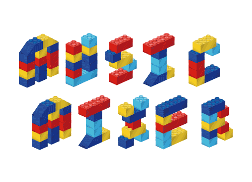
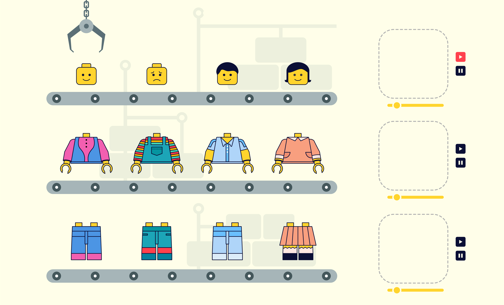
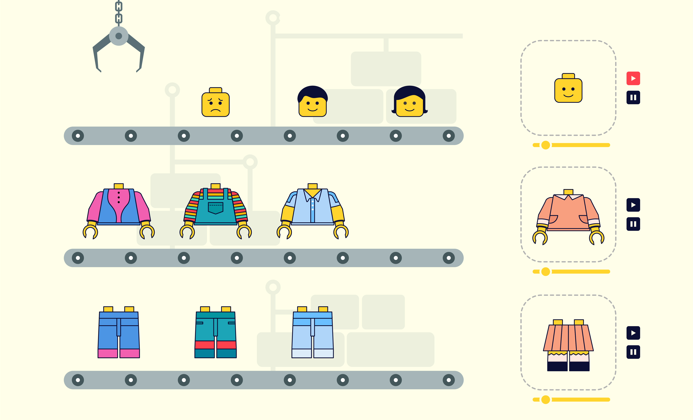

# Lego Music Mixer Play Game

**You can play a Fun Lego Music Mixer here!**  
Just pick any part of legos you want and drop in the box on the right.   
No matter how they fit together, music is going to play well.  
But! If you make them look little bit nicer, the sound would be way better I guess.  
Enjoy and have a relaxing time here 🎵 :musical_note:

---

| Feature  | Description                 |
| -------- | --------------------------- |
| Feature1 |  |
| Feature2 |  |

### Developer / Designer

Yeonju Kim

### Tool used

- HTML

- CSS3

- Javascript

- Markdown

### Inspiration site

Lego reference
[01](https://chasematt.com/LEGO-Wes-Anderson)
[02](https://chasematt.com/LEGO-Wes-Anderson)
[03](https://www.pinterest.co.kr/pin/461337555582712448/)
[04](https://dribbble.com/shots/4893105-1-Dribbble-Invite)

Factory reference
[01](https://www.pinterest.co.kr/pin/63331938499008888/)
[02](https://www.pinterest.co.kr/pin/173247916899383815/)
[03](https://www.pinterest.co.kr/pin/259027416046906560/)

### Before release

- [ ] Complete nice ReadMe file
- [ ] Check Drag and Drop effect
- [ ] Clean Document outline

##### Copyright ⓒ 2021 by YeonjuKim All rights reserved.
